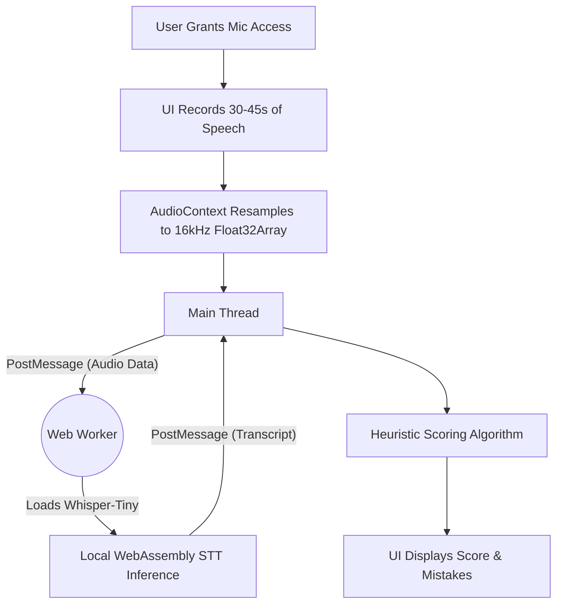

<div align="center">
  <h1>🎙️ PronounceAI</h1>
  <p><strong>100% Client-Side. Zero APIs. Instant Pronunciation Feedback.</strong></p>
  
  <p>
    <a href="https://nextjs.org/"></a>
    <a href="https://reactjs.org/"></a>
    <a href="https://tailwindcss.com/"></a>
    <a href="https://huggingface.co/docs/transformers.js/index"></a>
  </p>
</div>

---

## ✨ Overview

**PronounceAI** is a privacy-first web application designed to evaluate English pronunciation for language learners natively in the browser. 

Unlike traditional language learning apps that send your voice to cloud servers (incurring costs and privacy risks), PronounceAI downloads a highly optimized Artificial Intelligence model directly into your browser's memory. It evaluates your pacing, checks for filler words, and detects hesitation—all **locally on your device**.

## 🚀 Features

- **Perfect Privacy (DPDP Compliant)**: Audio never leaves your device. No backend databases, no third-party APIs, zero cloud storage.
- **Client-Side AI**: Powered by `@xenova/transformers` running the `Xenova/whisper-tiny.en` speech recognition model via WebAssembly.
- **Native Audio Recording**: Built-in 30-45 second microphone recorder with a beautiful pulsing UI.
- **File Upload Support**: Drag and drop `.wav` or `.mp3` files for instant evaluation.
- **Heuristic Scoring**: Get a score out of 100 based on your pacing (WPM), stuttering, and use of filler words ("um", "uh").
- **Actionable Feedback**: Highlights specific segments where you hesitated or spoke too quickly/slowly.

## 🛠️ Workflow & Architecture

The application is built using a modern React/Next.js architecture with off-thread Web Worker processing to ensure the UI remains buttery smooth while the heavy ML inference runs in the background.



### Components

- `src/hooks/useAudioRecorder.ts`: Manages the `MediaRecorder` API, chunks audio, enforces duration constraints, and handles device permissions.
- `src/hooks/useSpeechRecognition.ts`: Orchestrates the Web Worker lifecycle, downloading the model securely, and passing audio arrays for transcription.
- `src/utils/evaluation.ts`: Analyzes the transcribed text, calculates WPM pacing, and penalizes filler words or stuttering.
- `src/components/`: Modular React components for the UI, including the beautiful circular score indicator (`EvaluationResults.tsx`).

## 💻 Running Locally

### Prerequisites
- Node.js 18.x or later
- npm, yarn, pnpm, or bun

### Installation

1. **Clone the repository:**
   ```bash
   git clone https://github.com/Harsh-karn/PronounceAI.git
   cd PronounceAI
   ```

2. **Install dependencies:**
   ```bash
   npm install
   ```

3. **Start the development server:**
   ```bash
   npm run dev
   ```

4. **Open your browser:**
   Navigate to [http://localhost:3000](http://localhost:3000). The AI model (~40MB) will automatically download and cache in your browser on the first load.

## 🔒 Privacy & Data Policy

We treat data privacy with the utmost respect. PronounceAI is designed with the strictest adherence to India's **Digital Personal Data Protection (DPDP) Act 2023**:
- **Zero Data Transfer**: Your voice recordings are processed in the volatile memory (RAM) of your own device.
- **No Retention**: Once you close the tab, the audio and transcriptions are permanently destroyed by your browser's garbage collector.
- **Explicit Consent**: You must check the consent box before the microphone can be activated.

## 🤝 Contributing

Contributions, issues, and feature requests are welcome! Feel free to check the [issues page](https://github.com/Harsh-karn/PronounceAI/issues).

---
*Built with ❤️ for language learners worldwide.*
