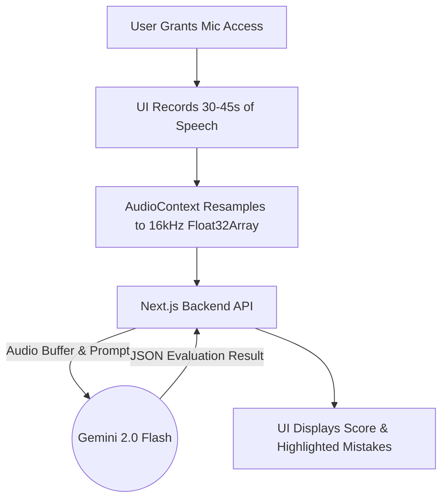

<div align="center">
  <h1>🎙️ PronounceAI</h1>
  <p><strong>Powered by Gemini AI. Instant Pronunciation Feedback.</strong></p>
  <p><strong>Live Demo: <a href="https://pronounce-ai-sandy.vercel.app/">pronounce-ai-sandy.vercel.app</a></strong></p>
  
  <p>
    <a href="https://nextjs.org/"></a>
    <a href="https://reactjs.org/"></a>
    <a href="https://tailwindcss.com/"></a>
    <a href="https://ai.google.dev/"></a>
  </p>
</div>

---

## ✨ Overview

**PronounceAI** is a web application designed to evaluate English pronunciation for language learners natively in the browser. 

Powered by **Google's Gemini 2.0 Flash AI**, the app evaluates your pacing, checks for filler words, detects hesitation, and points out specific mispronounced words with blazing fast response times.

## 🚀 Features

- **Gemini Powered Analytics**: Highly accurate transcriptions and heuristic scoring powered by the Gemini AI multimodal API.
- **Native Audio Recording**: Built-in 30-45 second microphone recorder with a beautiful pulsing UI.
- **File Upload Support**: Drag and drop `.wav`, `.webm`, or `.mp3` files for instant evaluation.
- **Actionable Feedback**: Get a score out of 100 and view specific highlighted segments in the transcript where you hesitated, spoke too quickly/slowly, or mispronounced words.

## 🛠️ Workflow & Architecture

The application is built using a modern React/Next.js architecture with API routes acting as a secure proxy to Google's Gemini models.



### Components

- `src/hooks/useAudioRecorder.ts`: Manages the `MediaRecorder` API, chunks audio, enforces duration constraints, and handles device permissions.
- `src/hooks/useSpeechRecognition.ts`: Orchestrates API calls to the Next.js backend and processes the structured JSON response.
- `src/app/api/evaluate/route.ts`: Secure backend route communicating with the Gemini API using the `@google/genai` SDK.
- `src/components/`: Modular React components for the UI, including the beautiful circular score indicator (`EvaluationResults.tsx`).

## 💻 Running Locally

### Prerequisites
- Node.js 18.x or later
- npm, yarn, pnpm, or bun
- A free **Google Gemini API Key** from [Google AI Studio](https://aistudio.google.com/)

### Installation

1. **Clone the repository:**
   ```bash
   git clone https://github.com/Harsh-karn/PronounceAI.git
   cd PronounceAI
   ```

2. **Install dependencies:**
   ```bash
   npm install
   ```

3. **Configure Environment Variables:**
   Create a `.env.local` file in the root directory and add your API key:
   ```env
   GEMINI_API_KEY=your_api_key_here
   ```

4. **Start the development server:**
   ```bash
   npm run dev
   ```

5. **Open your browser:**
   Navigate to [http://localhost:3000](http://localhost:3000).

## 🔒 Privacy & Data Policy

Your voice recordings are securely sent to Google's Gemini API for processing. We do not store your audio recordings or transcriptions in any database after the evaluation is complete. You must check the consent box before the microphone can be activated.

## 🤝 Contributing

Contributions, issues, and feature requests are welcome! Feel free to check the [issues page](https://github.com/Harsh-karn/PronounceAI/issues).

---
*Built with ❤️ for language learners worldwide.*
