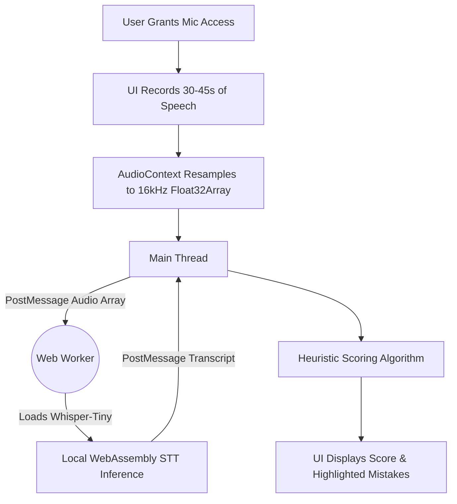

# PronounceAI System Architecture

**Live Demo**: [https://pronounce-ai-sandy.vercel.app/](https://pronounce-ai-sandy.vercel.app/)

This document describes the architecture of PronounceAI, a client-side web application designed to evaluate English pronunciation for language learners without relying on third-party APIs.

## System Components

1. **Frontend (Next.js & React)**
   - **Framework**: Next.js 14 App Router.
   - **Styling**: Tailwind CSS.
   - **Audio Capture**: Uses the browser's native `MediaRecorder` API to capture microphone input, enforcing a 30-45 second duration limit.
   - **File Upload**: Allows users to upload `.wav` or `.mp3` files, validating that the file length falls within the 30-45 second constraint.

2. **Web Worker Engine (Transformers.js)**
   - A background Web Worker runs `@xenova/transformers`.
   - The app uses the `Xenova/whisper-tiny.en` automatic speech recognition (ASR) model.
   - **Why this model over alternatives?** Running the model locally via WebAssembly removes the need for backend infrastructure and external API keys (e.g., OpenAI Whisper API, Azure Speech). It inherently solves data residency and privacy concerns by processing audio exclusively on the user's local machine, while being small enough (~40MB) to load quickly in a browser.

3. **Heuristic Evaluation Algorithm**
   - Instead of using a costly LLM to judge pronunciation, the frontend uses a heuristic algorithm applied to the speech-to-text (STT) output:
     - **Pacing**: Calculates Words Per Minute (WPM) to check if the user is speaking too quickly (>180 WPM) or too slowly (<90 WPM), and highlights the "Overall Pacing".
     - **Stuttering**: Detects consecutively repeated words, which often indicate hesitation, and highlights the specific segment.
     - **Filler Words**: Checks the transcript for common fillers ("um", "uh", "like") to penalize the score and highlight the exact filler words used.

## Architecture Diagram & Data Flow

---

## DPDP Act 2023 Compliance

PronounceAI handles user data in strict compliance with India's Digital Personal Data Protection (DPDP) Act 2023. By design, the architecture addresses every privacy constraint natively:

1. **Data Residency & Minimization**
   - By running inference locally in the browser via WebAssembly, **audio recordings never leave the user's device**. No data is transferred to any external server, guaranteeing perfect data residency within the user's own hardware.
   
2. **Consent**
   - The UI includes a mandatory, unchecked checkbox to obtain explicit, affirmative consent for local audio processing before the user can activate the microphone or upload a file.

3. **Storage, Retention, and Deletion**
   - **Storage**: No user audio, personal data, or evaluation metrics are ever stored in a database or file system.
   - **Retention & Deletion**: Audio processing occurs entirely in the browser's volatile memory (RAM). When the user clicks "Discard", closes the tab, or refreshes the page, the audio blobs and transcripts are immediately dereferenced and permanently deleted by the JavaScript garbage collector.

---

## Trade-offs & Future Improvements

**Trade-offs made:**
- **Client-Side Model Size vs. Quality**: The browser must download the model weights (~40MB for `whisper-tiny.en`) on the first load, which takes time. Additionally, the `tiny` model has a higher word error rate compared to larger cloud models (like Whisper `large-v3`). This trade-off was chosen to prioritize zero-cost scaling and complete user privacy.
- **Heuristic vs. Acoustic Scoring**: The current scoring system analyzes the text output (WPM, fillers, stuttering) rather than mapping acoustic phonemes to an expected pronunciation model. This is simpler to implement but misses subtle mispronunciations of individual syllables.

**What I would build next with more time:**
- Modify the Web Worker output to return phoneme-level confidence scores, allowing the UI to highlight the exact syllables a user mispronounced.
- Add an opt-in local database (like IndexedDB) so users can track their progress across sessions while maintaining local-only storage.
